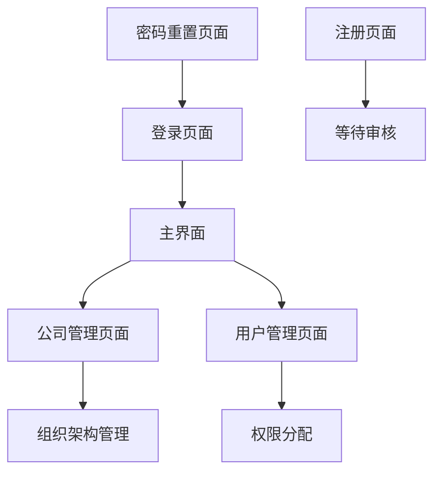

# 工时管理系统产品需求文档

## 1. 产品概述
工时管理系统是一个面向企业的员工工时记录和管理平台，支持多角色权限管理和公司组织架构管理。
系统通过身份证号码绑定用户身份，确保数据安全性，为企业提供高效的工时统计和人员管理解决方案。

## 2. 核心功能

### 2.1 用户角色
| 角色 | 注册方式 | 核心权限 |
|------|----------|----------|
| 员工 | 身份证号绑定注册 | 查看个人工时记录，提交工时数据 |
| 班长 | 身份证号绑定注册 | 管理班组成员工时，审核工时记录 |
| 段长 | 身份证号绑定注册 | 管理段内所有班组，查看段内工时统计 |
| 财务 | 身份证号绑定注册 | 查看所有工时数据，生成财务报表 |
| 生产经理 | 身份证号绑定注册 | 全局工时管理，用户权限管理 |

### 2.2 功能模块
我们的工时管理系统包含以下主要页面：
1. **登录页面**：手机号密码登录，身份验证
2. **注册页面**：身份证号绑定，公司选择，角色分配
3. **密码重置页面**：通过身份证号验证重置密码
4. **公司管理页面**：公司信息维护，组织架构管理
5. **用户管理页面**：用户信息管理，角色权限分配

### 2.3 页面详情
| 页面名称 | 模块名称 | 功能描述 |
|----------|----------|----------|
| 登录页面 | 用户认证 | 手机号密码登录验证，记住登录状态，跳转到主界面 |
| 注册页面 | 用户注册 | 身份证号验证，公司下拉选择，角色选择，密码设置，手机号绑定 |
| 密码重置页面 | 密码管理 | 身份证号验证，新密码设置，安全验证 |
| 公司管理页面 | 公司信息管理 | 公司信息增删改查，组织架构设置，部门管理 |
| 公司管理页面 | 组织架构 | 部门层级管理，人员分配，权限设置 |
| 用户管理页面 | 用户信息管理 | 用户基本信息维护，角色变更，状态管理 |
| 用户管理页面 | 权限管理 | 角色权限分配，功能权限控制，数据访问权限 |

## 3. 核心流程

**用户注册流程：**
用户访问注册页面 → 输入身份证号验证 → 选择公司（下拉菜单） → 选择角色 → 设置密码和手机号 → 提交注册 → 等待管理员审核

**用户登录流程：**
用户访问登录页面 → 输入手机号和密码 → 系统验证 → 登录成功跳转到主界面

**密码重置流程：**
用户访问密码重置页面 → 输入身份证号验证 → 设置新密码 → 确认重置

**管理员流程：**
管理员登录 → 访问公司管理界面创建/管理公司 → 访问用户管理界面审核用户注册 → 分配用户权限

## 4. 用户界面设计

### 4.1 设计风格
- 主色调：深绿色 (#1a4d3a) 和黑色 (#000000)
- 辅助色：亮绿色 (#00ff41) 和深灰色 (#2a2a2a)
- 按钮样式：圆角矩形，3D效果，霓虹绿色边框
- 字体：微软雅黑，标题18px，正文14px
- 布局风格：卡片式布局，顶部导航栏，朋克风格图标
- 图标样式：线条风格，霓虹绿色，科技感十足

### 4.2 页面设计概览
| 页面名称 | 模块名称 | UI元素 |
|----------|----------|--------|
| 登录页面 | 登录表单 | 黑色背景，绿色霓虹边框输入框，3D绿色登录按钮，朋克风格logo |
| 注册页面 | 注册表单 | 深色卡片布局，绿色标签，下拉菜单深色主题，角色选择按钮组 |
| 密码重置页面 | 重置表单 | 简洁黑绿配色，身份证验证区域，密码强度指示器 |
| 公司管理页面 | 数据表格 | 深色表格，绿色表头，悬浮效果，操作按钮霓虹绿色 |
| 用户管理页面 | 用户列表 | 卡片式用户信息展示，角色标签彩色区分，权限开关按钮 |

### 4.3 响应式设计
系统采用桌面优先设计，支持移动端自适应，考虑触摸交互优化，确保在各种设备上都能提供良好的用户体验。