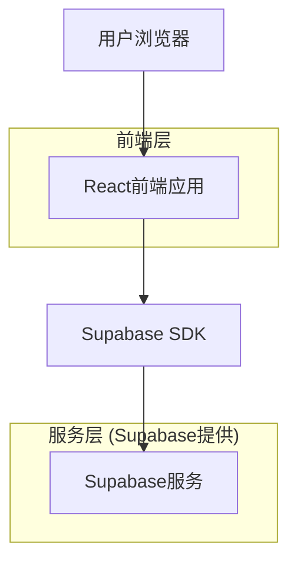
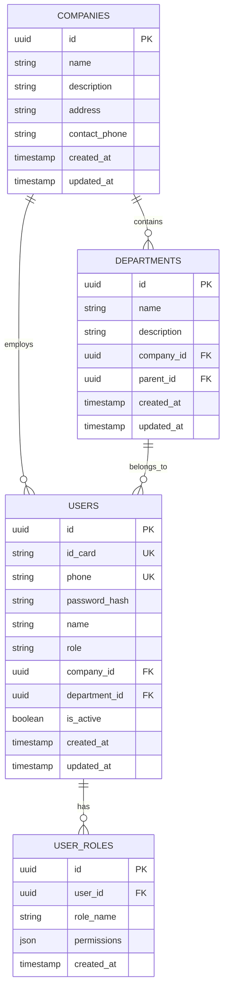

# 工时管理系统技术架构文档

## 1. 架构设计



## 2. 技术描述
- 前端：React@18 + TypeScript + Tailwind CSS + Vite
- 后端：Supabase (PostgreSQL + 认证 + 实时订阅)
- 状态管理：React Context + useState/useReducer
- 路由：React Router@6

## 3. 路由定义
| 路由 | 用途 |
|------|------|
| /login | 登录页面，用户手机号密码认证 |
| /register | 注册页面，身份证号绑定和角色选择 |
| /reset-password | 密码重置页面，通过身份证号验证 |
| /dashboard | 主控制台，根据角色显示不同功能 |
| /company-management | 公司管理页面，公司信息和组织架构管理 |
| /user-management | 用户管理页面，用户信息和权限管理 |

## 4. API定义

### 4.1 核心API

用户认证相关
```
POST /auth/login
```

请求参数：
| 参数名 | 参数类型 | 是否必需 | 描述 |
|--------|----------|----------|------|
| phone | string | true | 用户手机号 |
| password | string | true | 用户密码 |

响应参数：
| 参数名 | 参数类型 | 描述 |
|--------|----------|------|
| success | boolean | 登录状态 |
| user | object | 用户信息对象 |
| token | string | 认证令牌 |

示例：
```json
{
  "phone": "13800138000",
  "password": "123456"
}
```

用户注册相关
```
POST /auth/register
```

请求参数：
| 参数名 | 参数类型 | 是否必需 | 描述 |
|--------|----------|----------|------|
| id_card | string | true | 身份证号码 |
| phone | string | true | 手机号 |
| password | string | true | 密码 |
| company_id | string | true | 公司ID |
| role | string | true | 用户角色 |
| name | string | true | 用户姓名 |

公司管理相关
```
GET /api/companies
POST /api/companies
PUT /api/companies/:id
DELETE /api/companies/:id
```

用户管理相关
```
GET /api/users
PUT /api/users/:id
DELETE /api/users/:id
```

## 5. 数据模型

### 5.1 数据模型定义



### 5.2 数据定义语言

公司表 (companies)
```sql
-- 创建公司表
CREATE TABLE companies (
    id UUID PRIMARY KEY DEFAULT gen_random_uuid(),
    name VARCHAR(255) NOT NULL,
    description TEXT,
    address TEXT,
    contact_phone VARCHAR(20),
    created_at TIMESTAMP WITH TIME ZONE DEFAULT NOW(),
    updated_at TIMESTAMP WITH TIME ZONE DEFAULT NOW()
);

-- 创建索引
CREATE INDEX idx_companies_name ON companies(name);

-- 设置权限
GRANT SELECT ON companies TO anon;
GRANT ALL PRIVILEGES ON companies TO authenticated;

-- 初始数据
INSERT INTO companies (name, description, address, contact_phone) VALUES
('示例科技有限公司', '科技研发企业', '北京市朝阳区科技园', '010-12345678'),
('制造业集团', '生产制造企业', '上海市浦东新区工业园', '021-87654321');
```

用户表 (users)
```sql
-- 创建用户表
CREATE TABLE users (
    id UUID PRIMARY KEY DEFAULT gen_random_uuid(),
    id_card VARCHAR(18) UNIQUE NOT NULL,
    phone VARCHAR(11) UNIQUE NOT NULL,
    password_hash VARCHAR(255) NOT NULL,
    name VARCHAR(100) NOT NULL,
    role VARCHAR(20) NOT NULL CHECK (role IN ('员工', '班长', '段长', '财务', '生产经理')),
    company_id UUID REFERENCES companies(id),
    department_id UUID,
    is_active BOOLEAN DEFAULT true,
    created_at TIMESTAMP WITH TIME ZONE DEFAULT NOW(),
    updated_at TIMESTAMP WITH TIME ZONE DEFAULT NOW()
);

-- 创建索引
CREATE INDEX idx_users_company_id ON users(company_id);
CREATE INDEX idx_users_role ON users(role);
CREATE INDEX idx_users_phone ON users(phone);
CREATE INDEX idx_users_id_card ON users(id_card);

-- 设置权限
GRANT SELECT ON users TO anon;
GRANT ALL PRIVILEGES ON users TO authenticated;
```

部门表 (departments)
```sql
-- 创建部门表
CREATE TABLE departments (
    id UUID PRIMARY KEY DEFAULT gen_random_uuid(),
    name VARCHAR(255) NOT NULL,
    description TEXT,
    company_id UUID REFERENCES companies(id),
    parent_id UUID REFERENCES departments(id),
    created_at TIMESTAMP WITH TIME ZONE DEFAULT NOW(),
    updated_at TIMESTAMP WITH TIME ZONE DEFAULT NOW()
);

-- 创建索引
CREATE INDEX idx_departments_company_id ON departments(company_id);
CREATE INDEX idx_departments_parent_id ON departments(parent_id);

-- 设置权限
GRANT SELECT ON departments TO anon;
GRANT ALL PRIVILEGES ON departments TO authenticated;

-- 添加外键约束到用户表
ALTER TABLE users ADD CONSTRAINT fk_users_department 
    FOREIGN KEY (department_id) REFERENCES departments(id);
```

用户角色权限表 (user_roles)
```sql
-- 创建用户角色权限表
CREATE TABLE user_roles (
    id UUID PRIMARY KEY DEFAULT gen_random_uuid(),
    user_id UUID REFERENCES users(id),
    role_name VARCHAR(50) NOT NULL,
    permissions JSONB DEFAULT '{}',
    created_at TIMESTAMP WITH TIME ZONE DEFAULT NOW()
);

-- 创建索引
CREATE INDEX idx_user_roles_user_id ON user_roles(user_id);
CREATE INDEX idx_user_roles_role_name ON user_roles(role_name);

-- 设置权限
GRANT SELECT ON user_roles TO anon;
GRANT ALL PRIVILEGES ON user_roles TO authenticated;
```

更新时间触发器
```sql
-- 创建更新时间函数
CREATE OR REPLACE FUNCTION update_updated_at_column()
RETURNS TRIGGER AS $$
BEGIN
    NEW.updated_at = NOW();
    RETURN NEW;
END;
$$ language 'plpgsql';

-- 为各表创建更新时间触发器
CREATE TRIGGER update_companies_updated_at BEFORE UPDATE ON companies
    FOR EACH ROW EXECUTE FUNCTION update_updated_at_column();

CREATE TRIGGER update_users_updated_at BEFORE UPDATE ON users
    FOR EACH ROW EXECUTE FUNCTION update_updated_at_column();

CREATE TRIGGER update_departments_updated_at BEFORE UPDATE ON departments
    FOR EACH ROW EXECUTE FUNCTION update_updated_at_column();
```