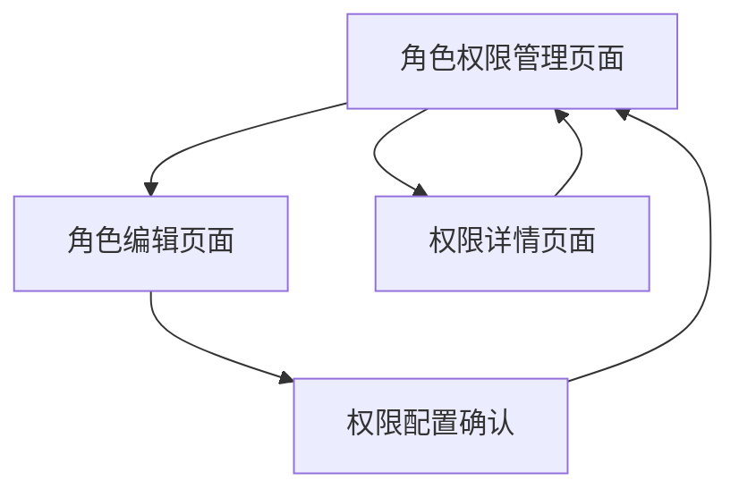

# 角色权限管理系统 - 产品需求文档

## 1. Product Overview

角色权限管理系统是工时管理平台的核心权限控制模块，用于管理不同用户角色的系统访问权限和功能操作权限。
- 解决企业内部不同岗位人员需要不同系统权限的问题，确保数据安全和操作规范性。
- 目标是建立完善的权限分级管理体系，提升系统安全性和管理效率。

## 2. Core Features

### 2.1 User Roles

| Role | Registration Method | Core Permissions |
|------|---------------------|------------------|
| 超级管理员 | 系统预设 | 可管理所有角色权限、系统配置 |
| 人事专员 | 管理员分配 | 可管理用户角色分配、查看权限配置 |
| 部门主管 | 管理员分配 | 可查看本部门权限配置 |
| 普通用户 | 无权限 | 仅可查看自己的角色信息 |

### 2.2 Feature Module

角色权限管理系统包含以下主要页面：
1. **角色权限管理页面**：角色列表展示、权限配置面板、权限分类管理
2. **角色编辑页面**：角色信息编辑、权限分配界面、权限模板选择
3. **权限详情页面**：权限说明展示、影响范围说明、使用统计

### 2.3 Page Details

| Page Name | Module Name | Feature description |
|-----------|-------------|---------------------|
| 角色权限管理页面 | 角色列表 | 显示所有角色名称、描述、权限数量、创建时间，支持搜索筛选 |
| 角色权限管理页面 | 权限配置面板 | 分类展示所有权限项，支持批量分配/取消权限，实时保存 |
| 角色权限管理页面 | 权限分类管理 | 按功能模块分类显示权限（用户管理、工时管理、项目管理等） |
| 角色权限管理页面 | 角色操作 | 新增角色、编辑角色、删除角色、复制角色权限 |
| 角色编辑页面 | 基本信息编辑 | 编辑角色名称、描述、状态等基本信息 |
| 角色编辑页面 | 权限分配界面 | 树形结构展示权限，支持全选/反选、权限继承关系 |
| 角色编辑页面 | 权限模板 | 提供预设权限模板（如普通员工模板、管理员模板等） |
| 权限详情页面 | 权限说明 | 详细说明每个权限的作用范围和影响 |
| 权限详情页面 | 使用统计 | 显示权限被分配的角色数量和用户数量 |

## 3. Core Process

**管理员操作流程：**
1. 进入角色权限管理页面查看所有角色
2. 选择需要编辑的角色或创建新角色
3. 在权限配置面板中分配或取消权限
4. 保存权限配置并生效
5. 查看权限变更日志

**权限分配流程：**
1. 选择目标角色
2. 在权限分类中选择功能模块
3. 勾选具体权限项
4. 预览权限影响范围
5. 确认并保存配置

## 4. User Interface Design

### 4.1 Design Style

- 主色调：绿色系（#10B981, #059669）
- 辅助色：灰色系（#6B7280, #F3F4F6）
- 按钮样式：圆角设计，绿色主题
- 字体：系统默认字体，标题16px，正文14px
- 布局风格：卡片式布局，左侧导航
- 图标风格：线性图标，简洁现代

### 4.2 Page Design Overview

| Page Name | Module Name | UI Elements |
|-----------|-------------|-------------|
| 角色权限管理页面 | 角色列表 | 表格布局，绿色表头，行悬停效果，操作按钮组 |
| 角色权限管理页面 | 权限配置面板 | 分组卡片设计，复选框样式，绿色选中状态 |
| 角色权限管理页面 | 搜索筛选 | 顶部搜索栏，下拉筛选器，绿色边框聚焦效果 |
| 角色编辑页面 | 表单区域 | 白色卡片背景，绿色边框输入框，标签左对齐 |
| 角色编辑页面 | 权限树 | 树形结构，展开/收起动画，绿色选中节点 |
| 权限详情页面 | 信息展示 | 描述性卡片，图标+文字组合，统计数字突出显示 |

### 4.3 Responsiveness

桌面优先设计，支持移动端自适应。在移动端权限配置面板采用折叠式设计，支持触摸操作优化。