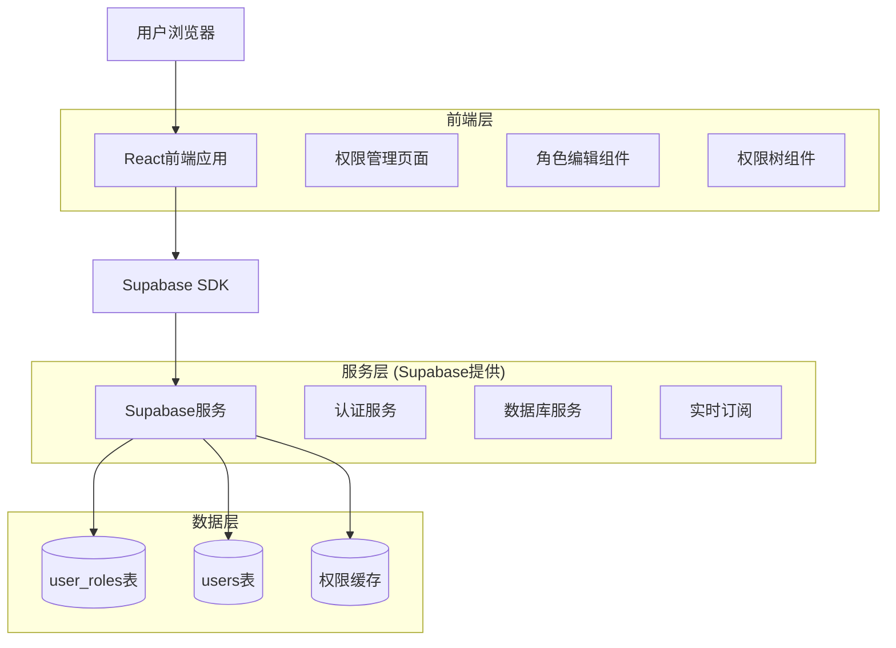
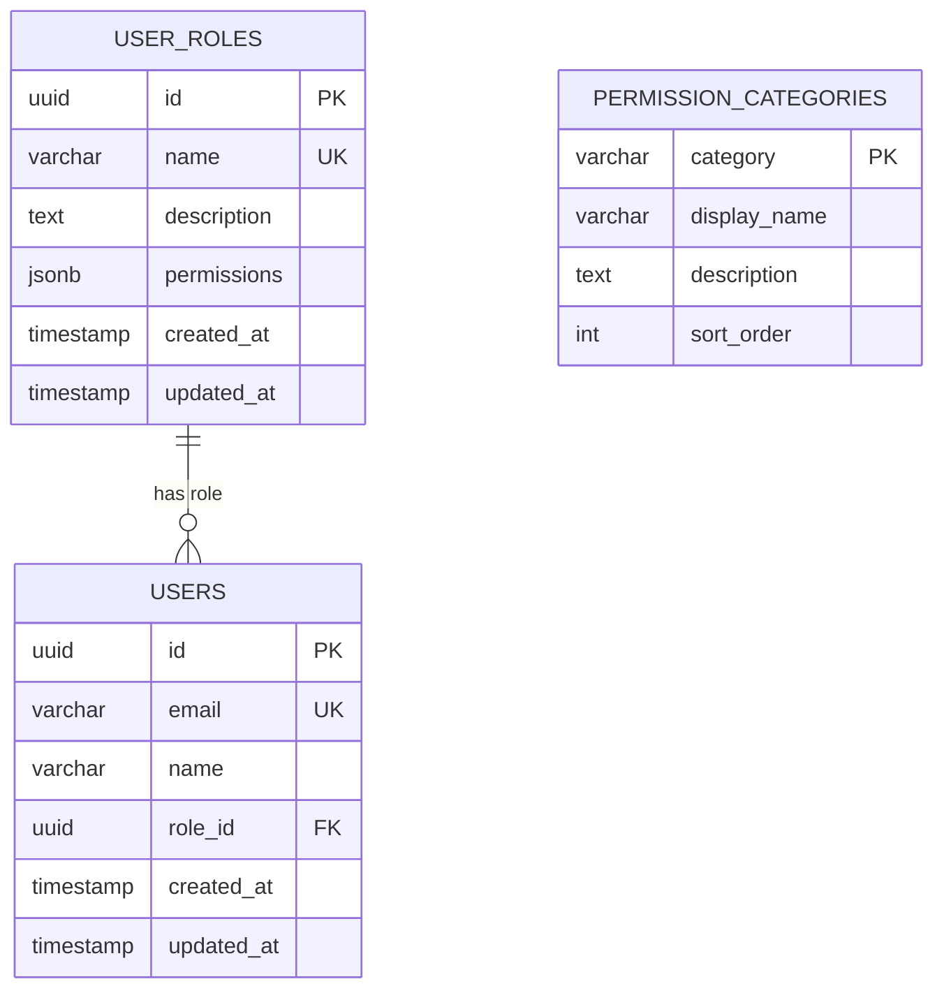

# 角色权限管理系统 - 技术架构文档

## 1. Architecture design



## 2. Technology Description

* Frontend: React\@18 + TypeScript + TailwindCSS\@3 + Vite

* Backend: Supabase (PostgreSQL + 实时API)

* 状态管理: React Context + useState/useEffect

* UI组件: 自定义组件 + Heroicons

* 数据验证: Zod

## 3. Route definitions

| Route                             | Purpose               |
| --------------------------------- | --------------------- |
| /role-permissions                 | 角色权限管理主页面，显示角色列表和权限配置 |
| /role-permissions/edit/:id        | 角色编辑页面，编辑特定角色的权限      |
| /role-permissions/create          | 新建角色页面，创建新的用户角色       |
| /role-permissions/permissions/:id | 权限详情页面，查看权限的详细信息和使用情况 |

## 4. API definitions

### 4.1 Core API

**角色管理相关**

获取所有角色

```typescript
// Supabase查询
const { data: roles } = await supabase
  .from('user_roles')
  .select('*')
  .order('created_at', { ascending: false })
```

创建角色

```typescript
// 请求参数
interface CreateRoleRequest {
  name: string
  description: string
  permissions: string[]
}

// Supabase插入
const { data, error } = await supabase
  .from('user_roles')
  .insert(roleData)
  .select()
```

更新角色权限

```typescript
// 请求参数
interface UpdateRolePermissionsRequest {
  id: string
  permissions: string[]
}

// Supabase更新
const { error } = await supabase
  .from('user_roles')
  .update({ permissions })
  .eq('id', roleId)
```

### 4.2 权限验证API

检查用户权限

```typescript
interface PermissionCheckRequest {
  userId: string
  permission: string
}

interface PermissionCheckResponse {
  hasPermission: boolean
  userRole: string
}
```

## 5. Data model

### 5.1 Data model definition



### 5.2 Data Definition Language

**权限分类表 (permission\_categories)**

```sql
-- 创建权限分类表
CREATE TABLE permission_categories (
  category VARCHAR(50) PRIMARY KEY,
  display_name VARCHAR(100) NOT NULL,
  description TEXT,
  sort_order INTEGER DEFAULT 0,
  created_at TIMESTAMP WITH TIME ZONE DEFAULT NOW()
);

-- 插入权限分类数据
INSERT INTO permission_categories (category, display_name, description, sort_order) VALUES
('user_management', '用户管理', '用户账户的创建、编辑、删除等操作权限', 1),
('timesheet_management', '工时管理', '工时记录的查看、审批、统计等权限', 2),
('project_management', '项目管理', '项目创建、分配、进度跟踪等权限', 3),
('department_management', '部门管理', '部门结构、人员分配等管理权限', 4),
('report_management', '报表管理', '各类报表的生成、导出、查看权限', 5),
('system_management', '系统管理', '系统配置、权限管理等高级权限', 6);

-- 为user_roles表添加RLS策略
ALTER TABLE user_roles ENABLE ROW LEVEL SECURITY;

-- 允许认证用户查看所有角色
CREATE POLICY "Allow authenticated users to view roles" ON user_roles
  FOR SELECT TO authenticated USING (true);

-- 只允许有user:manage权限的用户管理角色
CREATE POLICY "Allow role management for authorized users" ON user_roles
  FOR ALL TO authenticated 
  USING (
    EXISTS (
      SELECT 1 FROM users u 
      JOIN user_roles ur ON u.role_id = ur.id 
      WHERE u.id = auth.uid() 
      AND ur.permissions ? 'user:manage'
    )
  );

-- 创建权限检查函数
CREATE OR REPLACE FUNCTION check_user_permission(user_id UUID, required_permission TEXT)
RETURNS BOOLEAN AS $$
DECLARE
  user_permissions JSONB;
BEGIN
  SELECT ur.permissions INTO user_permissions
  FROM users u
  JOIN user_roles ur ON u.role_id = ur.id
  WHERE u.id = user_id;
  
  RETURN user_permissions ? required_permission;
END;
$$ LANGUAGE plpgsql SECURITY DEFINER;

-- 创建索引优化查询性能
CREATE INDEX idx_user_roles_permissions ON user_roles USING GIN (permissions);
CREATE INDEX idx_users_role_id ON users(role_id);
```

**权限常量定义**

```typescript
// 权限常量
export const PERMISSIONS = {
  // 用户管理
  USER_READ: 'user:read',
  USER_MANAGE: 'user:manage',
  USER_CREATE: 'user:create',
  USER_DELETE: 'user:delete',
  
  // 工时管理
  TIMESHEET_READ: 'timesheet:read',
  TIMESHEET_CREATE: 'timesheet:create',
  TIMESHEET_APPROVE: 'timesheet:approve',
  TIMESHEET_MANAGE: 'timesheet:manage',
  
  // 项目管理
  PROJECT_READ: 'project:read',
  PROJECT_MANAGE: 'project:manage',
  PROJECT_CREATE: 'project:create',
  
  // 部门管理
  DEPARTMENT_READ: 'department:read',
  DEPARTMENT_MANAGE: 'department:manage',
  
  // 报表管理
  REPORT_READ: 'report:read',
  REPORT_GENERATE: 'report:generate',
  REPORT_EXPORT: 'report:export',
  
  // 系统管理
  ROLE_MANAGE: 'role:manage',
  SYSTEM_CONFIG: 'system:config'
} as const;

// 权限分组
export const PERMISSION_GROUPS = {
  user_management: [
    PERMISSIONS.USER_READ,
    PERMISSIONS.USER_MANAGE,
    PERMISSIONS.USER_CREATE,
    PERMISSIONS.USER_DELETE
  ],
  timesheet_management: [
    PERMISSIONS.TIMESHEET_READ,
    PERMISSIONS.TIMESHEET_CREATE,
    PERMISSIONS.TIMESHEET_APPROVE,
    PERMISSIONS.TIMESHEET_MANAGE
  ],
  project_management: [
    PERMISSIONS.PROJECT_READ,
    PERMISSIONS.PROJECT_MANAGE,
    PERMISSIONS.PROJECT_CREATE
  ],
  department_management: [
    PERMISSIONS.DEPARTMENT_READ,
    PERMISSIONS.DEPARTMENT_MANAGE
  ],
  report_management: [
    PERMISSIONS.REPORT_READ,
    PERMISSIONS.REPORT_GENERATE,
    PERMISSIONS.REPORT_EXPORT
  ],
  system_management: [
    PERMISSIONS.ROLE_MANAGE,
    PERMISSIONS.SYSTEM_CONFIG
  ]
};
```

