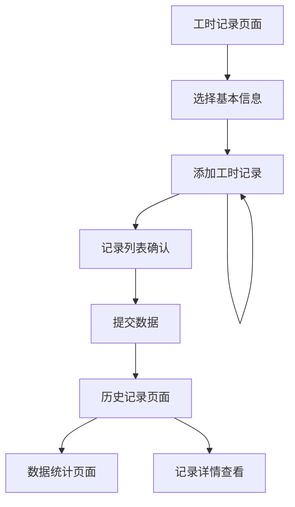

# 工时记录功能-产品需求文档

## 1. 产品概述
工时记录功能是工时管理系统的核心模块，允许员工记录日常工作时间和生产数据。员工可以选择基本信息（日期、生产线、班长、段长），添加多条工时记录（工时类型、产品、工序、数量），提交后形成历史记录供查询和管理。

该功能旨在提高生产数据的准确性和及时性，为企业生产管理和绩效考核提供可靠的数据支撑。

## 2. 核心功能

### 2.1 用户角色
| 角色 | 注册方式 | 核心权限 |
|------|----------|----------|
| 普通员工 | 管理员创建账户 | 记录自己的工时数据，查看自己的历史记录 |
| 班长 | 管理员创建账户 | 记录工时数据，查看本班组员工记录 |
| 段长 | 管理员创建账户 | 记录工时数据，查看本段所有记录 |
| 管理员 | 系统预设 | 查看和管理所有工时记录，导出数据 |

### 2.2 功能模块
工时记录功能包含以下主要页面：
1. **工时记录页面**：基本信息选择区域、工时记录添加区域、记录列表展示区域
2. **历史记录页面**：记录查询筛选、记录列表展示、记录详情查看
3. **数据统计页面**：工时统计图表、生产效率分析、导出功能

### 2.3 页面详情
| 页面名称 | 模块名称 | 功能描述 |
|----------|----------|----------|
| 工时记录页面 | 基本信息选择 | 选择记录日期、生产线、班长、段长等基础信息 |
| 工时记录页面 | 工时记录添加 | 选择工时类型、产品名称、产品工序，输入数量，支持添加多条记录 |
| 工时记录页面 | 记录列表展示 | 显示当前添加的工时记录列表，支持编辑和删除 |
| 工时记录页面 | 数据提交 | 验证数据完整性，提交工时记录到数据库 |
| 历史记录页面 | 查询筛选 | 按日期范围、生产线、产品等条件筛选历史记录 |
| 历史记录页面 | 记录列表 | 分页显示历史工时记录，支持排序和搜索 |
| 历史记录页面 | 记录详情 | 查看单条记录的详细信息，支持修改（权限内） |
| 数据统计页面 | 统计图表 | 显示工时统计、生产效率等图表分析 |
| 数据统计页面 | 数据导出 | 导出Excel格式的工时数据报表 |

## 3. 核心流程

### 员工工时记录流程
1. 员工登录系统进入工时记录页面
2. 选择记录日期（默认当天）
3. 选择所属生产线、班长、段长
4. 添加工时记录：选择工时类型、产品名称、产品工序，输入数量
5. 可继续添加多条工时记录
6. 检查记录信息无误后提交
7. 系统验证数据并保存到数据库
8. 显示提交成功信息，记录进入历史记录

### 历史记录查询流程
1. 进入历史记录页面
2. 设置查询条件（日期范围、生产线等）
3. 系统根据权限和条件筛选数据
4. 分页显示查询结果
5. 点击记录可查看详细信息
6. 根据权限可进行编辑或删除操作

## 4. 用户界面设计

### 4.1 设计风格
- **主色调**：蓝色系（#3B82F6）和灰色系（#6B7280）
- **按钮样式**：圆角矩形，悬停效果，主要按钮使用蓝色背景
- **字体**：系统默认字体，标题16px，正文14px，说明文字12px
- **布局风格**：卡片式布局，左右分栏，响应式设计
- **图标风格**：线性图标，统一使用Heroicons图标库

### 4.2 页面设计概览
| 页面名称 | 模块名称 | UI元素 |
|----------|----------|--------|
| 工时记录页面 | 基本信息选择 | 日期选择器、下拉选择框、标签显示，卡片布局，浅灰背景 |
| 工时记录页面 | 工时记录添加 | 表单输入框、下拉选择、数字输入、添加按钮，白色卡片，蓝色边框 |
| 工时记录页面 | 记录列表展示 | 表格布局、编辑删除按钮、序号显示，斑马纹背景 |
| 历史记录页面 | 查询筛选 | 日期范围选择、多选下拉框、搜索按钮，顶部固定布局 |
| 历史记录页面 | 记录列表 | 分页表格、排序功能、状态标签，响应式列宽 |
| 数据统计页面 | 统计图表 | 柱状图、折线图、饼图，Chart.js图表库，彩色主题 |

### 4.3 响应式设计
- **桌面优先**：主要针对桌面端设计，1200px以上最佳显示
- **移动适配**：768px以下自动调整为单列布局，表格转为卡片式
- **触摸优化**：按钮最小44px点击区域，支持手势操作