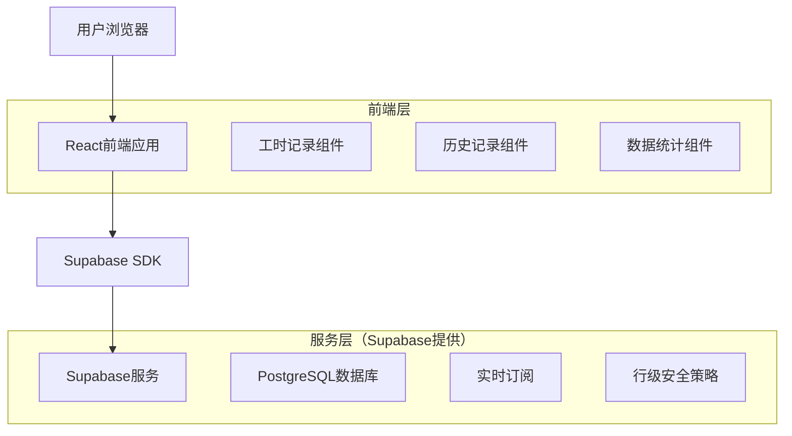
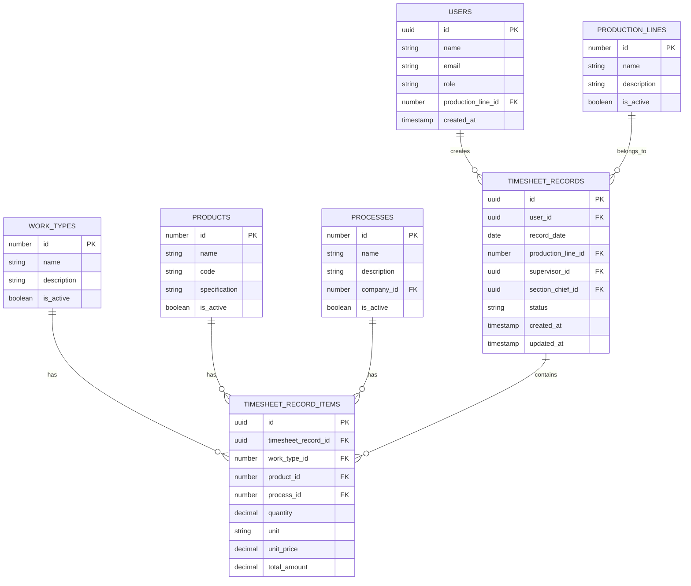

# 工时记录功能-技术架构文档

## 1. 架构设计



## 2. 技术描述

* 前端：React\@18 + TypeScript + Tailwind CSS\@3 + Vite

* 后端：Supabase（PostgreSQL + 实时API + 认证）

* 图表库：Chart.js + react-chartjs-2

* 日期处理：date-fns

* 表单验证：react-hook-form + zod

## 3. 路由定义

| 路由                    | 用途               |
| --------------------- | ---------------- |
| /timesheet            | 工时记录页面，员工录入工时数据  |
| /timesheet/history    | 历史记录页面，查看和管理工时记录 |
| /timesheet/statistics | 数据统计页面，工时分析和报表   |
| /timesheet/settings   | 设置页面，配置工时类型和产品信息 |

## 4. API定义

### 4.1 核心API

工时记录相关

```
POST /api/timesheet/records
```

请求参数：

| 参数名称                 | 参数类型   | 是否必需 | 描述                 |
| -------------------- | ------ | ---- | ------------------ |
| date                 | string | true | 记录日期（YYYY-MM-DD格式） |
| production\_line\_id | number | true | 生产线ID              |
| supervisor\_id       | number | true | 班长ID               |
| section\_chief\_id   | number | true | 段长ID               |
| records              | array  | true | 工时记录数组             |

工时记录数组结构：

| 参数名称           | 参数类型   | 是否必需 | 描述     |
| -------------- | ------ | ---- | ------ |
| work\_type\_id | number | true | 工时类型ID |
| product\_id    | number | true | 产品ID   |
| process\_id    | number | true | 工序ID   |
| quantity       | number | true | 数量     |
| unit           | string | true | 单位     |

响应：

| 参数名称    | 参数类型    | 描述      |
| ------- | ------- | ------- |
| success | boolean | 操作是否成功  |
| data    | object  | 创建的记录信息 |
| message | string  | 响应消息    |

示例：

```json
{
  "date": "2024-01-15",
  "production_line_id": 1,
  "supervisor_id": 5,
  "section_chief_id": 3,
  "records": [
    {
      "work_type_id": 1,
      "product_id": 10,
      "process_id": 15,
      "quantity": 100,
      "unit": "件"
    }
  ]
}
```

查询历史记录

```
GET /api/timesheet/records
```

查询参数：

| 参数名称                 | 参数类型   | 是否必需  | 描述         |
| -------------------- | ------ | ----- | ---------- |
| start\_date          | string | false | 开始日期       |
| end\_date            | string | false | 结束日期       |
| production\_line\_id | number | false | 生产线ID      |
| user\_id             | number | false | 用户ID       |
| page                 | number | false | 页码（默认1）    |
| limit                | number | false | 每页数量（默认20） |

## 5. 数据模型

### 5.1 数据模型定义



### 5.2 数据定义语言

工时记录主表（timesheet\_records）

```sql
-- 创建工时记录主表
CREATE TABLE timesheet_records (
    id UUID PRIMARY KEY DEFAULT gen_random_uuid(),
    user_id UUID NOT NULL REFERENCES auth.users(id),
    record_date DATE NOT NULL,
    production_line_id INTEGER NOT NULL REFERENCES production_lines(id),
    supervisor_id UUID REFERENCES auth.users(id),
    section_chief_id UUID REFERENCES auth.users(id),
    status VARCHAR(20) DEFAULT 'draft' CHECK (status IN ('draft', 'submitted', 'approved', 'rejected')),
    created_at TIMESTAMP WITH TIME ZONE DEFAULT NOW(),
    updated_at TIMESTAMP WITH TIME ZONE DEFAULT NOW()
);

-- 创建索引
CREATE INDEX idx_timesheet_records_user_id ON timesheet_records(user_id);
CREATE INDEX idx_timesheet_records_date ON timesheet_records(record_date DESC);
CREATE INDEX idx_timesheet_records_production_line ON timesheet_records(production_line_id);
CREATE UNIQUE INDEX idx_timesheet_records_user_date ON timesheet_records(user_id, record_date);
```

工时记录明细表（timesheet\_record\_items）

```sql
-- 创建工时记录明细表
CREATE TABLE timesheet_record_items (
    id UUID PRIMARY KEY DEFAULT gen_random_uuid(),
    timesheet_record_id UUID NOT NULL REFERENCES timesheet_records(id) ON DELETE CASCADE,
    work_type_id INTEGER NOT NULL REFERENCES work_types(id),
    product_id INTEGER NOT NULL REFERENCES products(id),
    process_id INTEGER NOT NULL REFERENCES processes(id),
    quantity DECIMAL(10,2) NOT NULL CHECK (quantity > 0),
    unit VARCHAR(10) NOT NULL DEFAULT '件',
    unit_price DECIMAL(10,2) DEFAULT 0,
    total_amount DECIMAL(10,2) GENERATED ALWAYS AS (quantity * unit_price) STORED,
    created_at TIMESTAMP WITH TIME ZONE DEFAULT NOW()
);

-- 创建索引
CREATE INDEX idx_timesheet_items_record_id ON timesheet_record_items(timesheet_record_id);
CREATE INDEX idx_timesheet_items_work_type ON timesheet_record_items(work_type_id);
CREATE INDEX idx_timesheet_items_product ON timesheet_record_items(product_id);
CREATE INDEX idx_timesheet_items_process ON timesheet_record_items(process_id);
```

生产线表（production\_lines）

```sql
-- 创建生产线表
CREATE TABLE production_lines (
    id SERIAL PRIMARY KEY,
    name VARCHAR(100) NOT NULL,
    description TEXT,
    is_active BOOLEAN DEFAULT true,
    created_at TIMESTAMP WITH TIME ZONE DEFAULT NOW()
);

-- 插入初始数据
INSERT INTO production_lines (name, description) VALUES
('生产线A', '主要生产线A'),
('生产线B', '主要生产线B'),
('生产线C', '主要生产线C');
```

工时类型表（work\_types）

```sql
-- 创建工时类型表
CREATE TABLE work_types (
    id SERIAL PRIMARY KEY,
    name VARCHAR(50) NOT NULL,
    description TEXT,
    is_active BOOLEAN DEFAULT true,
    created_at TIMESTAMP WITH TIME ZONE DEFAULT NOW()
);

-- 插入初始数据
INSERT INTO work_types (name, description) VALUES
('正常工时', '正常工作时间'),
('加班工时', '超出正常工作时间'),
('夜班工时', '夜间工作时间'),
('节假日工时', '节假日工作时间');
```

产品表（products）

```sql
-- 创建产品表
CREATE TABLE products (
    id SERIAL PRIMARY KEY,
    name VARCHAR(100) NOT NULL,
    code VARCHAR(50) UNIQUE NOT NULL,
    specification TEXT,
    is_active BOOLEAN DEFAULT true,
    created_at TIMESTAMP WITH TIME ZONE DEFAULT NOW()
);

-- 插入初始数据
INSERT INTO products (name, code, specification) VALUES
('产品A', 'PROD-A001', '规格说明A'),
('产品B', 'PROD-B001', '规格说明B'),
('产品C', 'PROD-C001', '规格说明C');
```

行级安全策略

```sql
-- 启用行级安全
ALTER TABLE timesheet_records ENABLE ROW LEVEL SECURITY;
ALTER TABLE timesheet_record_items ENABLE ROW LEVEL SECURITY;

-- 工时记录策略
CREATE POLICY "用户只能查看自己的工时记录" ON timesheet_records
    FOR SELECT USING (auth.uid() = user_id);

CREATE POLICY "用户只能创建自己的工时记录" ON timesheet_records
    FOR INSERT WITH CHECK (auth.uid() = user_id);

CREATE POLICY "用户只能更新自己的工时记录" ON timesheet_records
    FOR UPDATE USING (auth.uid() = user_id);

-- 管理员可以查看所有记录
CREATE POLICY "管理员可以查看所有工时记录" ON timesheet_records
    FOR ALL USING (
        EXISTS (
            SELECT 1 FROM auth.users 
            WHERE auth.users.id = auth.uid() 
            AND auth.users.raw_user_meta_data->>'role' IN ('管理员', '超级管理员')
        )
    );

-- 工时记录明细策略
CREATE POLICY "用户只能查看自己的工时明细" ON timesheet_record_items
    FOR SELECT USING (
        EXISTS (
            SELECT 1 FROM timesheet_records 
            WHERE timesheet_records.id = timesheet_record_items.timesheet_record_id 
            AND timesheet_records.user_id = auth.uid()
        )
    );

CREATE POLICY "用户只能创建自己的工时明细" ON timesheet_record_items
    FOR INSERT WITH CHECK (
        EXISTS (
            SELECT 1 FROM timesheet_records 
            WHERE timesheet_records.id = timesheet_record_items.timesheet_record_id 
            AND timesheet_records.user_id = auth.uid()
        )
    );
```

权限设置

```sql
-- 授权给认证用户
GRANT ALL PRIVILEGES ON timesheet_records TO authenticated;
GRANT ALL PRIVILEGES ON timesheet_record_items TO authenticated;
GRANT SELECT ON production_lines TO authenticated;
GRANT SELECT ON work_types TO authenticated;
GRANT SELECT ON products TO authenticated;
GRANT SELECT ON processes TO authenticated;

-- 授权给匿名用户（只读基础数据）
GRANT SELECT ON production_lines TO anon;
GRANT SELECT ON work_types TO anon;
GRANT SELECT ON products TO anon;
```

